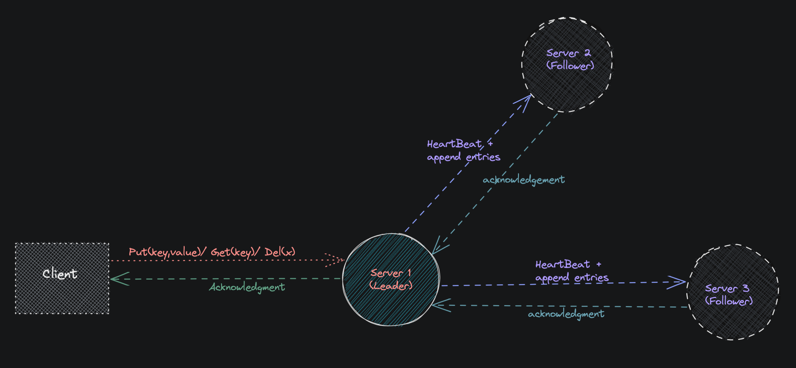

Raft distributed consensus algorithm.
==
It is the algorithm which used to achieve the **consensus**(to make a decision or to share data) in distributed systems. 
In this **Distributed Consensus** is achieved with help of Leader Election and Log Replication.

Raft Overview
====
1.  Initially all the nodes are in follower state and each nodes have timer(randomised initialised).
2.  Then time out occurs of one of the node this leads to that node becomes candidate and triggers an **election** to become **Leader**.
3.  It vote for himself and Send Request Msg RPC to all nodes asking them to vote for him.
4.  If it get the majority of vote then it will declare itself as a **Leader** and send Heartbeat msg RPC to all followers nodes to tell them that it becomes the Leader of this Term and reset their Timer.
4.  Leader have to keep sending the Heartbeat msg (Append Enteries + no logs) to all its followers, so that they will not able to trigger an election.

* 1.**Leader Election:**
    * Select one of the node as the cluster Leader. It is achieved by Leader Election.
    * Only Elected Leader node can respond to the client.All other node have to sync-up with Leader.
* 2.**Log Replication:**
    * All the changes have to gone through the Leader.
    * Leader replicates its log to all other its followers nodes.

   

### ResearchPaper
https://raft.github.io/raft.pdf

### other Useful Resources
- http://thesecretlivesofdata.com/raft/
- https://medium.com/@kasunindrasiri/understanding-raft-distributed-consensus-242ec1d2f521
