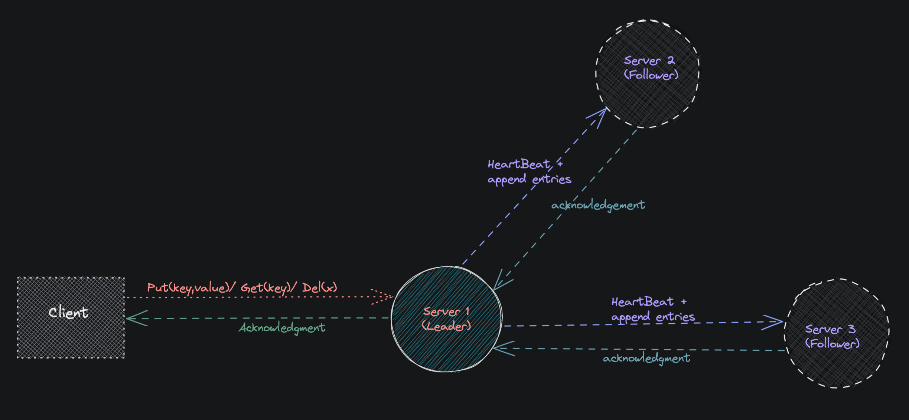

Raft distributed consensus algorithm.
==
It is the algorithm which used to achieve the **consensus**(to make a decision or to share data) in distributed systems. 
**Consensus** is achieved by Leader Election and Log Replication.

Raft Overview
====
**Initially** All the nodes are in follower state,then time out occurs of one of the node this leads to that node becomes candidate and triggers an election to become Leader.Send Msg RPC to all nodes asking them to vote for him.

* 1.**Leader Election:**
    * Select one of the node as the cluster Leader. It is achieved by Leader Election.
    * Only Elected Leader node can respond to the client.All other node have to sync-up with Leader.
* 2.**Log Replication:**
    * All the changes have to gone through the Leader.
    * Leader replicates its log to all other its followers nodes.

   

### ResearchPaper
https://raft.github.io/raft.pdf

### other Useful Resources
- http://thesecretlivesofdata.com/raft/
- https://medium.com/@kasunindrasiri/understanding-raft-distributed-consensus-242ec1d2f521
