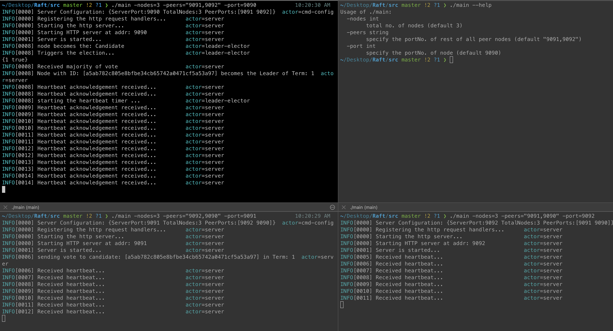

## Demo

1. Compile: `$go build main.go`
2.  `$./main --help`
    ```
    Usage of ./main:
      -nodes int
          total no. of nodes (default 3)
      -peers string
          specify the portNo. of rest of all peer nodes (default "9091,9092")
      -port int
          specify the portNo. of node (default 9090)
    ```

3. Start the 3 terminal: 

`$./main -nodes=3 -peers="9091,9092" -port=9090` <br/>
`$./main -nodes=3 -peers="9092,9090" -port=9091` <br/>
`$./main -nodes=3 -peers="9091,9090" -port=9092` <br/>


